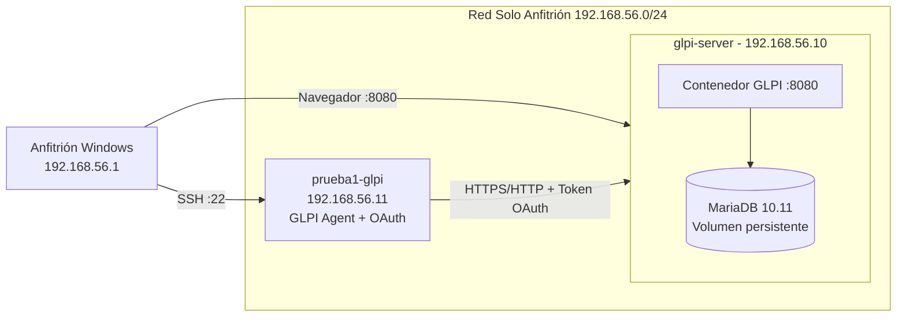

```mermaid
graph LR
    Host[Anfitrión Windows<br/>192.168.56.1] -->|Navegador :8080| Server
    Host -->|SSH :22| Client
    subgraph VirtualBox [Red Solo Anfitrión 192.168.56.0/24]
        Client[prueba1-glpi<br/>192.168.56.11<br/>GLPI Agent + OAuth] -->|HTTPS/HTTP + Token OAuth| Server
        subgraph Server [glpi-server - 192.168.56.10]
            GLPI[Contenedor GLPI :8080] --> DB[(MariaDB 10.11<br/>Volumen persistente)]
        end
    end
```